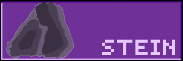

# DXBY.DEV
### My website

This project is my website [dxby.dev](https://dxby.dev) developed with [Astro](https://astro.build/) and TypeScript.

## Prerequisites

Make sure you have the following tools installed:

- [Node.js](https://nodejs.org/) (recommended: version 16.x or higher)
- [npm](https://www.npmjs.com/) or [yarn](https://yarnpkg.com/) (for installing dependencies)

## Installation

1. **Clone the repository**

   ```bash
   git clone https://github.com/IamSTEINI/dxby.dev.git
   ```

2. **Navigate to the project directory**

   ```bash
   cd dxby.dev
   ```

3. **Install dependencies**

   If you are using `npm`:

   ```bash
   npm install
   ```

   If you are using `yarn`:

   ```bash
   yarn install
   ```

## Running the Development Server

Start the development server to view the website locally:

```bash
npm run dev
```

Or, if you are using `yarn`:

```bash
yarn dev
```

Then visit `http://localhost:3000` in your web browser to see your website.

## Building the Project

Build the project for production to create an optimized version of the website:

```bash
npm run build
```

Or, if you are using `yarn`:

```bash
yarn build
```

The built code will be saved in the `dist` directory.

## Linting and Formatting

This project uses [ESLint](https://eslint.org/) for code analysis and [Prettier](https://prettier.io/) for formatting.
## License

This project is licensed under the [Apache 2.0](LICENSE).

